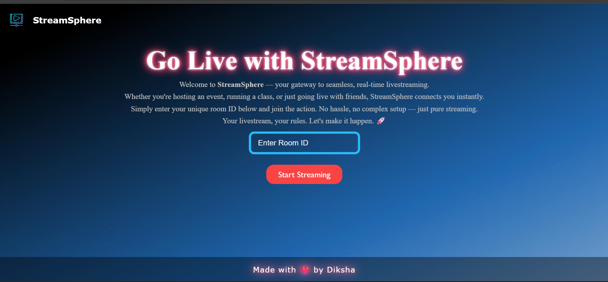
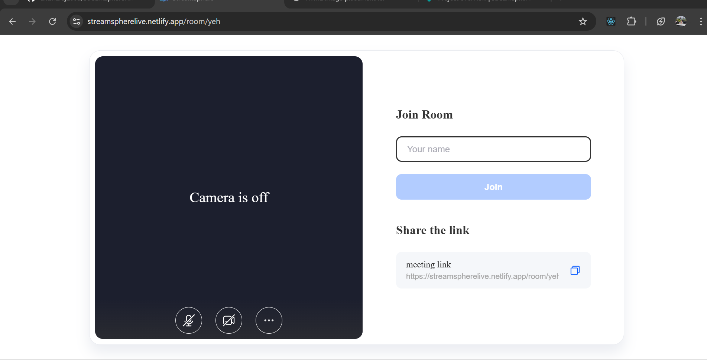
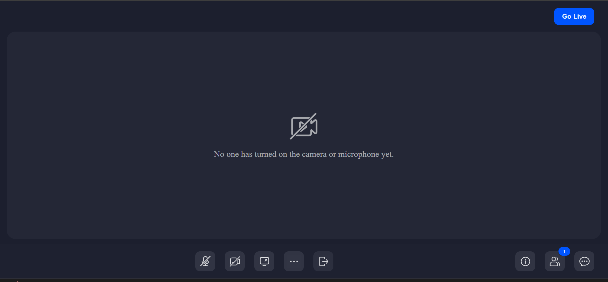

# 🌐 StreamSphere

**StreamSphere** is a modern, real-time video conferencing web application built with **React** and **ZegoUIKitPrebuilt** by **ZegoCloud**. It allows users to create or join secure video rooms with ease — perfect for online meetings, casual hangouts, or remote collaboration.

---

## 🚀 Features

- 🔗 One-click room creation and joining via unique room IDs
- 🎥 High-definition video and audio streaming
- 🔒 Secure and dynamic video rooms
- 👥 Multi-participant support
- ⚡ Fast, responsive, and mobile-friendly UI
- 🌍 No downloads or plugins required

---

## 🛠 Tech Stack

- **React.js**
- **ZegoUIKitPrebuilt SDK (ZegoCloud)**
- **React Router DOM**
- **Vite**
- **HTML / CSS**


-------

📸 Screenshots




*******************************



*******************************



-------

🌐 Live Demo
Link:(https://streamspherelive.netlify.app/)


----

## 📦 Installation

```bash
# Clone the repository
git clone https://github.com/diksharaj2005/streamsphere.git

# Navigate into the project directory
cd streamsphere

# Install dependencies
npm install

# Start the development server
npm run dev'''


